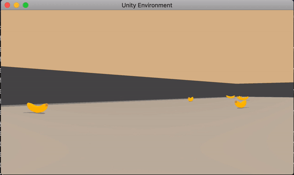

# Project 1: Navigation

Author: [Aman Dalmia](http://github.com/dalmia) 

The project demonstrates the ability of value-based methods, specifically, [Deep Q-learning](https://storage.googleapis.com/deepmind-media/dqn/DQNNaturePaper.pdf) and its variants, to learn a suitable policy in a model-free Reinforcement Learning setting using a Unity environment, which consists of a continuous state space of 37 dimensions, with the goal to navigate around and collect yellow bananas (reward: +1) while avoiding blue bananas (reward: -1). There are 4 actions to choose from: move left, move right, move forward and move backward. A agent choosing actions randomly can be seen in motion below:

 

The following report is written in four parts:

- **Implementation**
- **Results**
- **Ideas for improvement** 

## Implementation

At the heart of the learning algorithm is the , [Deep Q-learning](https://storage.googleapis.com/deepmind-media/dqn/DQNNaturePaper.pdf), which surpassed human-level performance in Atari games. It is an off-policy learning algorithm where the policy being evaluated is different from the policy being learned.

To step back for a bit, the idea of Q-learning is to learn the action-value function, often denoted as          `Q(s, a)` , where `s` represents the current state and `a` represents the action being evaluated. Q-learning is a form of Temporal-Difference learning (TD-learning), where unlike Monte-Carlo methods, we can learn from each step rather than waiting for an episode to complete. The idea is that once we take an action and are thrust into a new state, we use the current Q-value of that state as the estimate for future rewards. 

  

There's one specific problem here. Since our space is continuous, we can't use a tabular representation. Hence, we use a `Function Approximator`. The idea behind a function approximator is to introduce a new parameter $\theta$ that helps us to obtain an approximation of the `Q(s, a)`, $\hat{Q} (s, a; \theta)$. So, this becomes a supervised learning problem where the approximation $\hat{Q}$ represents the expected value and $R + \gamma * max (Q(s', a))$ becomes the target. We then use mean-square error as the loss function and update the weights accordingly using gradient descent. Now, the choice remains to choose the function approximator. Enter **Deep Learning**! We use a neural network as function approximator here. More specifically, we choose a 2-hidden layer network with both the layers having 64 hidden units with `relu` activation applied after each fully-connected layer. `Adam` was used as the optimizer for finding the optimal weights.

The implementation was done in PyTorch.  